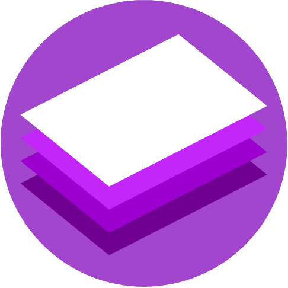

Pascal Cơ Bản
=============

Giới thiệu
----------

Quyển sách "Pascal Cơ Bản" này được biên tập bởi nhóm
[42tm](http://github.com/42tm), nội dung được viết bởi những lập trình viên trẻ
đầy tâm huyết của nhóm. Tên những người đóng góp được ghi cụ thể, chi tiết
[tại đây](CREDITS.md).

Đây là cuốn sách miễn phí và không chính thống, được tạo ra vì mục đích học tập
và không liên kết với bất kì tổ chức, công ty chính thức nào về Pascal. Tất cả
thương hiệu và nhãn hiệu đã đăng ký là tài sản của chủ sở hữu công ty tương ứng.

> **Lưu ý**: Pascal được nói tới trong cuốn sách là Pascal phiên bản thường,
không phải Object Pascal (Pascal hướng đối tượng).

Tuy đã được xem xét kĩ lưỡng nhưng cuốn sách vẫn có thể có một số lỗi, mong bạn
đọc chỉ ra và đóng góp bằng cách gửi thư điện tử tới fourtytwotm@gmail.com hoặc
tạo một Issue cho kho chứa này.

Giấy phép
---------

Tất cả nội dung của văn bản được phát hành dưới giấy phép [Creative Commons
Attribution phiên bản 4.0](http://creativecommons.org/licenses/by/4.0/).
Điều này có nghĩa là bạn có thể sao chép, chỉnh sửa, hoặc/và phân phối cuốn
sách hay một hoặc nhiều đoạn văn bản của cuốn sách, với mục đích thương mại hay
riêng tư, nhưng với điều kiện bạn phải cung cấp tên tác giả của cuốn sách
(trong trường hợp này là nhóm 42tm), và bạn phải kèm theo giấy phép CC BY 4.0,
hoặc ít nhất là cung cấp một đường dẫn tới giấy phép.

**Lưu ý**: Nếu bạn không thực hiện đúng ít nhất một trong những điều trên, bạn
đang vi phạm pháp luật.

### Ví dụ

Giả sử bạn đưa một đoạn văn bản được trích từ cuốn sách này vào slide thuyết
trình của bạn. Bạn cần phải ghi rõ tên tác giả, có thể là ở bên dưới đoạn trích
hay ở slide cuối:

> Có một khẳng định như sau:
>
> "Trong giao tiếp ngày thường, khi mọi người nói đến máy tính, họ đang nói đến
máy tính cá nhân, tức bao gồm máy tính xách tay và máy tính để bàn. Với điện
thoại, họ gọi nó là điện thoại chứ không gọi nó là máy tính. Tương tự như thế
với TV. Khi nói đến máy tính, mọi người cũng có thể đang nói đến máy tính cầm
tay."
>
> _Trích từ cuốn sách Sổ Tay Pascal của nhóm 42tm_

Bạn cũng phải cung cấp tên của giấy phép, hoặc/và đường dẫn tới giấy phép,
có thể là ở bên dưới đoạn trích hay ở slide cuối:

> Cảm ơn & Ghi chú
>
> - Các hình ảnh trong slide thuyết trình này được chụp bởi John Doe, Jane Doe,
và Richard Doe, tất cả được cấp dưới giấy phép CC-BY-SA 4.0
> - Các video trong slide thuyết trình là của Tim Doe, đã được sự đồng ý cho
> sử dụng của tác giả
> - Đoạn trích trong slide 6 là từ cuốn sách Sổ Tay Pascal của nhóm 42tm, được
> cấp giấy phép CC-BY 4.0

Chúng tôi nhắc lại, nếu bạn không thực hiện đúng những điều này, bạn đang vi
phạm pháp luật.
