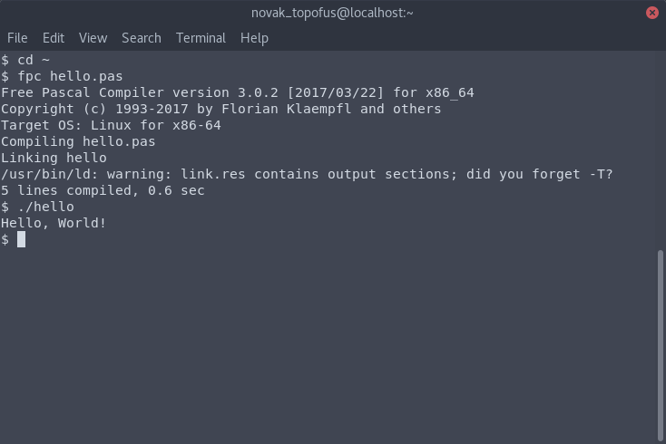

# Chương 1: Bắt đầu với ngôn ngữ Pascal
Trong phần này, bạn sẽ biết được:
- Hai dạng cơ bản của một chương trình máy tính
- Trình biên dịch là gì, và các trình biên dịch phổ biến của ngôn ngữ Pascal
- Trình biên tập mã và môi trường phát triển tích hợp là gì
- Cách viết chương trình Hello World nổi tiếng, và hiểu rõ từng dòng lệnh trong chương trình đó
- Cách biên dịch một tệp mã nguồn Pascal, và cách chạy chương trình Pascal từ giao diện dòng lệnh
- Cách viết ghi chú trong ngôn ngữ Pascal
## Mục lục
1. [Chương trình máy tính](#ch%C6%B0%C6%A1ng-tr%C3%ACnh-m%C3%A1y-t%C3%ADnh)
2. [Trình biên dịch](#tr%C3%ACnh-bi%C3%AAn-d%E1%BB%8Bch)
3. [Trình biên tập mã và môi trường phát triển tích hợp](#tr%C3%ACnh-bi%C3%AAn-t%E1%BA%ADp-m%C3%A3-v%C3%A0-m%C3%B4i-tr%C6%B0%E1%BB%9Dng-ph%C3%A1t-tri%E1%BB%83n-t%C3%ADch-h%E1%BB%A3p)
4. [Viết chương trình Pascal đầu tiên](#vi%E1%BA%BFt-ch%C6%B0%C6%A1ng-tr%C3%ACnh-pascal-%C4%91%E1%BA%A7u-ti%C3%AAn)
    - [Phân tích mã nguồn của chương trình Hello World](#ph%C3%A2n-t%C3%ADch-m%C3%A3-ngu%E1%BB%93n-c%E1%BB%A7a-ch%C6%B0%C6%A1ng-tr%C3%ACnh-hello-world)
5. [Biên dịch chương trình Pascal](#bi%C3%AAn-d%E1%BB%8Bch-ch%C6%B0%C6%A1ng-tr%C3%ACnh-pascal)
    - [Trên hệ điều hành Windows](#tr%C3%AAn-h%E1%BB%87-%C4%91i%E1%BB%81u-h%C3%A0nh-windows)
    - [Trên một bản phân phối của GNU/Linux](#tr%C3%AAn-m%E1%BB%99t-b%E1%BA%A3n-ph%C3%A2n-ph%E1%BB%91i-c%E1%BB%A7a-gnulinux)
6. [Chạy chương trình Pascal](#ch%E1%BA%A1y-ch%C6%B0%C6%A1ng-tr%C3%ACnh-pascal)
7. [Ghi chú trong chương trình](#ghi-ch%C3%BA-trong-ch%C6%B0%C6%A1ng-tr%C3%ACnh)
8. [Chú giải](#ch%C3%BA-gi%E1%BA%A3i)
## Chương trình máy tính
Bạn có thể làm rất nhiều thứ trên máy tính. Soạn thảo văn bản, tra cứu trên Internet, chơi một trò chơi điện tử, vân vân. Máy tính trông có thể đang làm rất nhiều việc, nhưng nói ở một mức độ cơ bản thì máy tính là một cỗ máy chỉ biết nghe lời. Bạn viết một **chương trình**, bạn đưa cho máy tính thực hiện, và nó thực hiện đúng những gì mà bạn muốn, không thừa không thiếu. Có thể đó là một chương trình mà chỉ đơn giản là chương trình in các dòng chữ lên màn hình. Hoặc chương trình đó có thể là một trò chơi hấp dẫn.

Một chương trình máy tính có hai dạng: **dạng mã nguồn** (source code) và **dạng có thể thực thi** (executable). Nói chung thì sự khác biệt giữa hai dạng này là: dạng mã nguồn thì có thể được đọc bởi các lập trình viên mà biết ngôn ngữ lập trình của mã nguồn đó, còn dạng có thể thực thi chính là dạng gồm số 1 và số 0 mà chỉ máy tính có thể hiểu, còn ngay cả các lập trình viên cũng bó tay. Khi bạn viết “code”, thì tức là bạn viết mã nguồn.
- - -
Ví dụ: Một chương trình in ra dòng chữ “Hello, World!” viết bằng ngôn ngữ Python  
Dạng mã nguồn:
```python
print(“Hello, World!”)
```

Dạng có thể thực thi:
```
00000000: 00110011 00001101 00001101 00001010 10010001 00000111  3.....
00000006: 01011110 01011010 00010111 00000000 00000000 00000000  ^Z....
0000000c: 11100011 00000000 00000000 00000000 00000000 00000000  ......
00000012: 00000000 00000000 00000000 00000000 00000000 00000000  ......
00000018: 00000000 00000010 00000000 00000000 00000000 01000000  .....@
0000001e: 00000000 00000000 00000000 01110011 00001100 00000000  ...s..
00000024: 00000000 00000000 01100101 00000000 01100100 00000000  ..e.d.
0000002a: 10000011 00000001 00000001 00000000 01100100 00000001  ....d.
00000030: 01010011 00000000 00101001 00000010 01111010 00001101  S.).z.
00000036: 01001000 01100101 01101100 01101100 01101111 00101100  Hello,
0000003c: 00100000 01010111 01101111 01110010 01101100 01100100   World
00000042: 00100001 01001110 00101001 00000001 11011010 00000101  !N)...
00000048: 01110000 01110010 01101001 01101110 01110100 10101001  print.
0000004e: 00000000 01110010 00000010 00000000 00000000 00000000  .r....
00000054: 01110010 00000010 00000000 00000000 00000000 11111010  r.....
0000005a: 00001000 01101000 01100101 01101100 01101100 01101111  .hello
00000060: 00101110 01110000 01111001 11011010 00001000 00111100  .py..<
00000066: 01101101 01101111 01100100 01110101 01101100 01100101  module
0000006c: 00111110 00000001 00000000 00000000 00000000 01110011  >....s
00000072: 00000000 00000000 00000000 00000000                    ....
```
- - -
Tóm lại, con người viết mã nguồn bằng ngôn ngữ lập trình nào đó, như Pascal, và biến dạng mã nguồn đó thành dạng có thể thực thi để máy tính có thể hiểu và thực hiện những gì ta đã vạch ra trong mã nguồn. Nhưng làm thể nào để chuyển đổi một chương trình từ dạng mã nguồn sang dạng có thể thực thi?

Câu trả lời nằm ở một phần mềm nào đó mà có thể giúp ta thực hiện điều này. Tùy theo ngôn ngữ lập trình viên đã sử dụng là ngôn ngữ được **biên dịch** hay **thông dịch**. Vì **ngôn ngữ Pascal là ngôn ngữ được biên dịch**, nên ta sẽ nói đến **trình biên dịch**. Đối với ngôn ngữ thông dịch và trình thông dịch thì các bạn hãy tìm hiểu thêm.

## Trình biên dịch
**Trình biên dịch là một phần mềm dùng để chuyển một chương trình từ dạng mã nguồn sang dạng có thể thực thi được**. Nó thường nhận một tệp tin chứa mã nguồn, và xử lý tệp tin đó, rồi cho ra một tệp tin khác mà bạn có thể kích đúp chuột lên tệp tin đó để chạy chương trình/phần mềm của mình. Tệp tin mà bạn có thể kích đúp chuột lên để chạy, đó chính là dạng có thể thực thi của chương trình mà bạn đã cho làm đầu vào ở dạng mã nguồn.

Mỗi ngôn ngữ lập trình có trình biên dịch riêng của mình. Một ngôn ngữ thì có thể có nhiều trình biên dịch khác nhau. Bảng sau cho biết một số trình biên dịch phổ biến cho ngôn ngữ Pascal.

|            Tên trình biên dịch            | Tên thực thi |        Trạng thái       |
|                     ---                   |      ---     |            ---          |
|[Free Pascal](https://www.freepascal.org/) |     `fpc`    |   Tiếp tục phát triển   |
|[GNU Pascal](http://www.gnu-pascal.de/)    |     `gpc`    | Ngừng phát triển (2006) |
|Turbo Pascal (Borland Pascal)              |     `tpc`    | Ngừng phát triển (1997) |

Vì Free Pascal hiện tại vẫn đang được phát triển và hỗ trợ, và Free Pascal có thể chạy trên mọi hệ điều hành phổ biến ngày nay, nên trong quyển sách này, các hướng dẫn liên quan đến trình biên dịch của Pascal sẽ lấy Free Pascal làm mẫu, và nhóm tác giả chúng tôi cũng khuyên bạn nên dùng Free Pascal. Bạn có thể đến [trang này](https://freepascal.org/download.var) để tải trình biên dịch Free Pascal.

## Trình biên tập mã và môi trường phát triển tích hợp
Một phần mềm mà giúp người dùng viết mã và chỉnh sửa mã là một **trình biên tập mã** (tiếng Anh là _**text editor**_). Trình biên tập mã thường hỗ trợ việc viết mã trong mọi ngôn ngữ lập trình. “Hỗ trợ” ở đây, với nghĩa đơn giản nhất tức là có tính năng syntax highlighting ([1](#ch%C3%BA-gi%E1%BA%A3i)) cho bất cứ ngôn ngữ nào. Visual Studio Code là một ví dụ của trình biên tập mã. Bạn mở trình biên tập lên, bạn tạo một tệp tin mới, và bạn chọn ngôn ngữ bạn muốn viết, sau đó bạn viết mã.

Một **môi trường phát triển tích hợp** (tiếng Anh là _Integrated Development Environment_, viết tắt là _**IDE**_) thì lại khác. Đó là phần mềm cho phép người dùng viết mã nguồn, nhưng còn tích hợp cả một trình gỡ lỗi ([2](#ch%C3%BA-gi%E1%BA%A3i)), và tích hợp luôn cả trình biên dịch/thông dịch của ngôn ngữ đó, để người dùng khi viết mã xong họ có thể chạy chương trình chỉ bằng cách bấm một nút. Thường thì môi trường phát triển tích hợp chỉ hỗ trợ việc phát triển chương trình viết bằng một ngôn ngữ nào đó (hay có thể hai, hay ba, nhưng thường thì các ngôn ngữ đó có liên quan thân mật với nhau), chứ không phải ngôn ngữ nào cũng viết được như trong một trình biên tập mã. Ví dụ, Eclipse là một môi trường phát triển tích hợp cho ngôn ngữ Java, PyCharm là một môi trường phát triển thích hợp cho ngôn ngữ Python. Trong PyCharm, người dùng viết chương trình bằng ngôn ngữ Python, sau đó có thể bấm nút trên thanh công cụ, và thế là phần mềm PyCharm chạy chương trình mà người dùng đã viết.

Ngôn ngữ Pascal cũng có một số môi trường phát triển tích hợp. Môi trường phát triển tích hợp Free Pascal tích hợp trình biên dịch Free Pascal. Môi trường phát triển tích hợp Turbo Pascal tích hợp trình biên dịch Turbo Pascal. Cả hai môi trường phát triển tích hợp này đều không có giao diện đẹp, nên chúng tôi khuyên các bạn nên dùng một trình biên tập mã như Notepad++ hay Sublime Text.

## Viết chương trình Pascal đầu tiên
Chương trình Pascal chúng ta viết đầu tiên sẽ là chương trình Hello World. Chương trình Hello World là một chương trình chỉ in ra  dòng chữ “Hello, World!”, không có gì hơn. Vì đây là chương trình đơn giản nhất với mọi ngôn ngữ lập trình, nên việc viết chương trình Hello World lấy làm chương trình đầu tiên của một người học lập trình đã trở thành một “truyền thống”.

Chúng ta hãy cùng viết chương trình Hello World bằng ngôn ngữ Pascal!  
Mở một trình biên tập mã, và viết những dòng lệnh sau:
```pascal
Program HelloWorld;

Begin
    Writeln('Hello, World!');
End.
```
Lưu thành một tệp tin, đặt tên là “hello.pas".  
**Lưu ý**: phần mở rộng của tệp tin chứa mã nguồn ngôn ngữ Pascal là “pas”.

### Phân tích mã nguồn của chương trình Hello World  
```pascal
Program HelloWorld;
```
Dòng này giúp trình biên dịch biết rằng tên chương trình của bạn là HelloWorld. Thông thường, nếu bạn chỉ viết một tệp thì dòng này có vẻ không cần thiết nhưng khi bạn chia mã nguồn thành các tệp nhỏ thì bạn bắt buộc phải viết dòng này để phân biệt.  
```pascal
Begin
```
Đây là dòng để bắt đầu chương trình chính. Sau này khi học đến chương trình con, bạn sẽ biết rằng từ khóa `Begin` cũng được dùng để bắt đầu chương trình con.  
```pascal
Writeln('Hello, World!');
```
Dòng này sử dụng hàm `Writeln()` được dùng để in dòng chữ “Hello, World!” ra màn hình. Lưu ý rằng “Hello, World!” được đặt trong hai dấu phẩy trên (').  
```pascal
End.
```
Đây là dòng để kết thúc chương trình chính. Tương tự như từ khóa `Begin`, từ khóa `End` cũng được dùng để kết thúc chương trình con mà sau này chúng ta sẽ động đến.  

Cần lưu ý rằng, đối với ngôn ngữ lập trình Pascal, cũng như hầu hết các ngôn ngữ lập trình khác, cần phải tuân theo các quy tắc đã được định ra một cách chặt chẽ. Ví dụ, bạn phải có dấu chấm phẩy (;) sau các câu lệnh Pascal (ngoại trừ các từ khóa như `Begin`, `If`, `else`). Sau từ khóa `End` mà kết thúc chương trình chính, cần phải có dấu chấm. Nếu thiếu dấu chấm này, hay không tuân theo bất cứ quy tắc nào, trình biên dịch sẽ thông báo chương trình lỗi và không cho ra chương trình dạng có thể thực thi nữa.

## Biên dịch chương trình Pascal
Chúng ta đã viết chương trình Hello World bằng cách viết mã Pascal. Bây giờ chúng ta cần biên dịch nó thành tệp nhị phân (tệp gồm dãy BIT chứa số 1 và số 0) để máy tính có thể hiểu và chạy chương trình.
### Trên hệ điều hành Windows
Lưu tệp tin hello.pas của bạn (chứa chương trình Hello World) vào ổ C:. Ngay trong ổ C:, chứ không trong thư mục nào hết. Sau đó, mở cửa sổ Command Prompt ([3](#ch%C3%BA-gi%E1%BA%A3i)) bằng cách nhấn tổ hợp phím Windows + R, sau đó gõ “cmd”, sau đó nhấn phím Enter. Một cửa sổ như sau sẽ hiện lên.  
  
Trong cửa sổ đó, gõ `C:`, nhấn Enter, sau đó gõ `fpc hello.pas`, rồi nhấn Enter. Như vậy là trình biên dịch sẽ cho ra một tệp tin mới có tên là _hello.exe_ trong cùng thư mục .
### Trên một bản phân phối của GNU/Linux
Lưu tệp tin hello.pas tại địa chỉ HOME của bạn (ví dụ: /home/blaisepascal/). Sau đó, mở một cửa sổ terminal ([3](#ch%C3%BA-gi%E1%BA%A3i)). Trong cửa sổ đó, gõ `cd ~`, nhấn Enter, sau đó gõ `fpc hello.pas`, rồi nhấn Enter. Trình biên dịch Free Pascal sẽ tạo một tệp mới tên là `hello`, và đó chính là dạng có thể thực thi của chương trình Hello World chúng ta đã viết (bạn có thể kiểm chứng bằng cách gõ lệnh `ls` - lệnh này theo mặc định sẽ liệt kê các tệp tin và thư mục không bị ẩn trong thư mục hiện hành).

## Chạy chương trình Pascal
Chúng ta đã có tệp tin mà chính là dạng có thể thực thi mà trình biên dịch đã tạo ra. Bây giờ, để chạy chương trình đó, các bạn gõ `hello.exe` nếu đang ở trên hệ điều hành Windows, hay `./hello` nếu bạn đang xài GNU/Linux. Khi thực hiện, chương trình có thể thực thi sẽ in ra dòng chữ "Hello, World!".  


## Ghi chú trong chương trình
Khi viết mã nguồn, các lập trình viên thường viết ghi chú, chủ yếu là để giải thích một đoạn mã này sẽ làm công việc gì. Các ghi chú chỉ dành cho lập trình viên đọc, chứ không phải để máy tính hiểu, cho nên các trình biên dịch/thông dịch hoàn toàn bỏ qua các ghi chú.
Trong ngôn ngữ Pascal (cụ thể hơn là với Free Pascal), khi muốn viết ghi chú trên một dòng, bạn gõ "//", và sau đó là ghi chú của bạn. Khi muốn viết ghi chú trên nhiều dòng, bạn có thể dùng cặp ký tự "{" và "}" hoặc "(\*" và "\*)". Bất kỳ cái gì ở giữa ký tự "{" và "}" ( hay "(\*" và "\*)" ) thì sẽ được coi là ghi chú. Dưới đây là một ví dụ.
```pascal
Program CommentDemo;
Uses Crt;
Var n: Integer;

Begin
    {
        Chương trình CommentDemo.
        Được tạo bởi H. Dương.
    }

    n := 5;  // Gán biến n giá trị 5
    Inc(n);

    (*
        Các bạn chưa cần hiểu đoạn mã trên vội!
        Cứ từ từ, rồi chúng ta sẽ học!
    *)
End.
```

- - -
## Chú giải
1. **syntax highlighting** : Là một tính năng của các trình biên tập mã dùng để hiển thị mã với các màu khác nhau cho các thể loại cú pháp khác nhau
2. **Trình gỡ lỗi** : Là một phần mềm giúp lập trình viên phát hiện lỗi và gỡ lỗi trong chương trình của mình
3. **Command Prompt**, **Terminal** : Nói chung, Command Prompt là cửa sổ cho phép bạn gõ lệnh để điều khiển máy tính trong hệ điều hành Windows. Terminal là cửa sổ có chức năng tương tự nhưng là trên hệ điều hành GNU/Linux.
