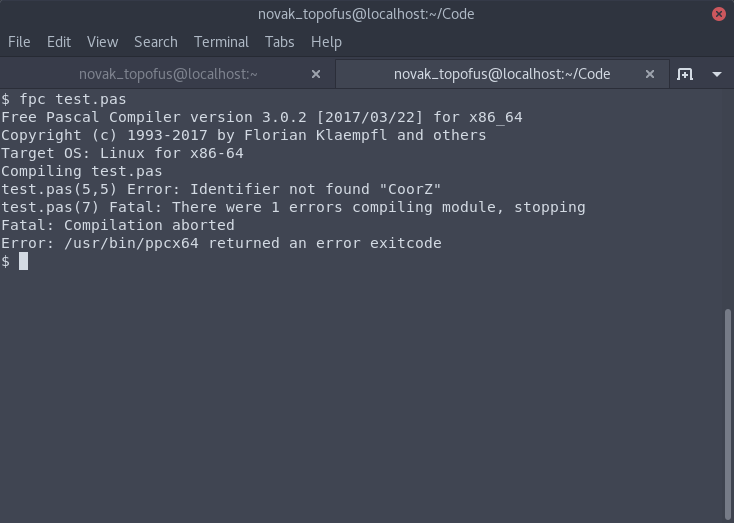
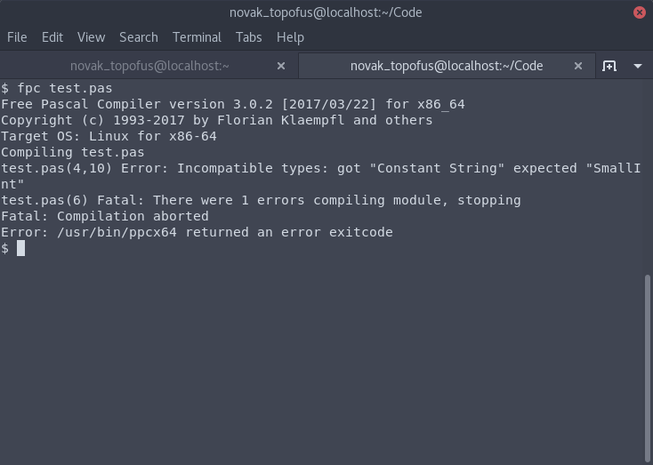
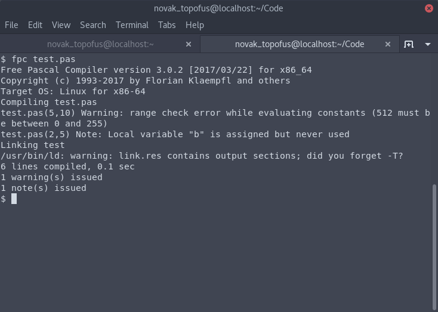

# Chương 2: Biến số, hằng số và kiểu dữ liệu
Trong chương này, bạn sẽ biết được:
- Kiểu dữ liệu là gì
- Biến số là gì, và các thao tác cơ bản với biến số trong Pascal
- Hằng số là gì, và cách gán giá trị cho các hằng số trong Pascal
- Các lỗi cơ bản xung quanh biến số và hằng số trong Pascal
- Từ khóa `Type` dùng để làm gì
## Mục lục
1. [Kiểu dữ liệu](#kiểu-dữ-liệu)
2. [Biến số](#biến-số)
    - [Các thao tác cơ bản với biến số trong ngôn ngữ Pascal](#các-thao-tác-cơ-bản-với-biến-số-trong-ngôn-ngữ-pascal)
        - [Khai báo biến số](#khai-báo-biến-số)
        - [Gán giá trị cho biến số](#gán-giá-trị-cho-biến-số)
3. [Hằng số](#hằng-số)
4. [Các lỗi cơ bản xung quanh biến số và hằng số trong Pascal](#các-lỗi-cơ-bản-xung-quanh-biến-số-và-hằng-số-trong-pascal)
    1. [Lỗi sử dụng biến số và hằng số chưa được khai báo](#1-lỗi-sử-dụng-biến-số-và-hằng-số-chưa-được-khai-báo)
    2. [Lỗi gán giá trị không có cùng kiểu dữ liệu đã đặt ra cho biến số](#2-lỗi-gán-giá-trị-không-có-cùng-kiểu-dữ-liệu-đã-đặt-ra-cho-biến-số)
    3. [Lỗi gán giá trị không trong giới hạn](#3-lỗi-gán-giá-trị-không-trong-giới-hạn)
    4. [Lỗi thay đổi giá trị của hằng số](#4-lỗi-thay-đổi-giá-trị-của-hằng-số)
5. [Từ khóa `Type`](#từ-khóa-type)
## Kiểu dữ liệu
Dữ liệu trong máy tính có nhiều kiểu, ví dụ như kiểu số nguyên, kiểu số thực, kiểu chuỗi ký tự. Ngôn ngữ Pascal cũng có các kiểu dữ liệu. Một số kiểu dữ liệu có sẵn được liệt kê trong bảng sau. Các kiểu dữ liệu quan trọng và hay được sử dụng được in đậm.  

|  Kiểu dữ liệu |                               Định nghĩa                                 |             Giới hạn             |
|      ---      |                                   ---                                    |                ---               |
| **`boolean`** | Kiểu dữ liệu chỉ có thể mang một trong hai giá trị: `true` hoặc `false`  | `true` và `false`                |
|     `byte`    | Số nguyên không âm                                                       | Từ 0 đến 255                     |
|     `word`    | Số nguyên không âm, nhưng có giới hạn xa hơn dữ liệu kiểu `byte`         | Từ 0 đến 65 535                  |
|     `char`    | Ký tự                                                                    | Các ký tự trong bảng mã ASCII    |
| **`integer`** | Số nguyên                                                                | Từ -32 768 đến 32 767            |
|   **`real`**  | Số thực                                                                  | Phụ thuộc vào nền tảng đang chạy |
|   `cardinal`  | Số nguyên không âm với giới hạn lớn                                      | Từ 0 đến 4 294 967 295           |
|     `set`     | Tập hợp các phần tử liên quan tới nhau, kích cỡ tùy vào số lượng phần tử | -                                |
|   `pointer`   | Con trỏ trỏ tới một vị trí trong bộ nhớ                                  | -                                |
|    `record`   | Kiểu cho phép kết hợp nhiều kiểu dữ liệu với nhau                        | -                                |
|  **`array`**  | Mảng - Tập hợp các đối tượng cùng kiểu dữ liệu                           | -                                |
|  **`string`** | Xâu ký tự - Mảng tập hợp các đối tượng là ký tự                          | Từ 0 đến 255 ký tự               |

Ứng dụng phổ biến nhất của kiểu dữ liệu là xác định kiểu dữ liệu cho giá trị của một biến số. Ví dụ, biến số `a` có giá trị là một số nguyên, biến số  `foo` có giá trị là một số thực, biến số  `bar` có giá trị của một biến số kiểu boolean.

Máy tính có giới hạn, nên các kiểu dữ liệu có giới hạn. Ví dụ, trong ngôn ngữ Pascal, giá trị kiểu số nguyên `integer` không thể vượt quá 32 767 (như bảng trên). Nếu trong chương trình Pascal mà bạn dùng số nguyên có kiểu `integer` nào có giá trị quá 32767, chương trình sẽ gặp lỗi.

Có thể bạn đang thắc mắc, "Tại sao đã có kiểu dữ liệu `byte` là số nguyên, mà còn phải có kiểu dữ liệu `word` có giới hạn xa hơn để làm gì?". Câu trả lời là, kiểu dữ liệu này có thể chiếm bộ nhớ ít hoặc nhiều hơn kiểu dữ liệu kia. Chúng ta sẽ tìm hiểu thêm trong phần về tối ưu bộ nhớ.

## Biến số
Lập trình không chỉ dừng lại ở chương trình Hello World. Để có thể làm được nhiều thứ tuyệt vời hơn, chúng tôi cần giới thiệu với bạn khái niệm về **biến số**.

Ví dụ, tôi nhờ bạn ghi nhớ hai số: 42 và 7. Não bạn sẽ giành hai khoảng không trong bộ nhớ để ghi nhớ số 42 và số 7. Bây giờ tôi nhờ bạn cộng số 3 vào số 7 bạn đã ghi nhớ. Não bạn sẽ nhớ đến số 7, cộng 3 vào đó, và có số 10.

Máy tính cũng có thể thực hiện điều như trên với biến số. **Biến số là một đại lượng được đặt tên và có giá trị. Giá trị này có thể thay đổi.**

Minh họa ví dụ trên:
```
a = 42
b = 7

b = b + 3
```
Trong minh họa, có thể thấy lúc đầu biến số có tên là "`a`" mang giá trị là 42. Biến số có tên là "`b`" mang giá trị 7. Sau đó ta lại thay đổi giá trị của biến số  "`b`" bằng cách cộng 3 vào giá trị hiện tại của biến số  "`b`", là 7. Bây giờ biến số  "`b`" có giá trị là 7 + 3 = 10.
### Các thao tác cơ bản với biến số trong ngôn ngữ Pascal
#### Khai báo biến số
Trong Pascal, để khai báo biến số, bạn dùng từ khóa `Var` ở ngay đầu chương trình, như dòng thứ 2 trong chương trình sau.

```pascal
Program VariableDefineDemo;
Var a: integer;

Begin
End.
```

Trong ví dụ trên, biến số  `a` được khai báo và kiểu dữ liệu chúng ta đã định ra là `integer`. Điều này có nghĩa là, biến số  `a` có thể mang một giá trị số nguyên trong giới hạn của nó, tức là trong giữa khoảng từ -32 768 đến 32 767, theo như bảng các kiểu dữ liệu mà chúng ta đã tìm hiểu ở phần đầu của chương.
Giả sử chúng ta muốn khai báo các biến số  `a`, `b`, và `c` đều có kiểu dữ liệu số nguyên `integer`, ta có thể khai báo trên cùng một dòng, ngăn cách với dấu phẩy.

```pascal
Program VariableDefineDemo;
Var a, b, c: integer;

Begin
End.
```

Giả sử chúng ta muốn đặt thêm biến số  `s` có kiểu dữ liệu là `string`. Chúng ta có thể thêm một dòng sau dấu chấm phẩy ở phần khai báo biến số.
```pascal
Program VariableDefineDemo;
Var a, b, c: integer; s: string;

Begin
End.
```

Tuy nhiên, với các biến số có các kiểu dữ liệu khác nhau, nên khai báo trên các dòng riêng.
```pascal
Program VariableDefineDemo;
Var a, b, c: integer;
    s, MyName: string;
    c, ConfKey, EndLine: char;

Begin
End.
```
#### Gán giá trị cho biến số
Bạn có thể gán giá trị cho biến số trong chương trình chính (hoặc chương trình con) sử dụng ký hiệu “`:=`” với cấu trúc là `TÊN_BIẾN := GIÁ_TRỊ`.
```pascal
Program VarAssignDemo;
Var a: Integer;

Begin
    a := 42;
End.
```

Bạn cũng có thể gán giá trị ngay trong phần khai báo, sử dụng dấu bằng.
```pascal
Program VarAssignDemo;
Var b: Integer = 7;  // Biến số b mang giá trị là 7

Begin
End.
```

Như đã đề cập, giá trị của biến số có thể thay đổi. Để thay đổi giá trị của một biến số thì không có gì đặc biệt, các bạn vẫn cứ dùng ký hiệu "`:=`" như thường.
```pascal
Var a, b: Integer;

Begin
    a := 5;
    b := 8;  // Biến số b mang giá trị là 8
    b := 10;  // Biến số b mang giá trị là 10
    // Giá trị cuối cùng của biến số b là 10.
End.
```

Các bạn cũng có thể gán giá trị của biến số này vào giá trị của biến số kia.
```pascal
Var Ans: Integer = 37;
    get: Integer;

Begin
    get := Ans;  // Biến số get bây giờ có giá trị của biến số Ans, tức là 37
End.
```

Chúng ta còn có thể gán giá trị của một biến với giá trị của chính nó với một thay đổi nào đó.
```pascal
Var MyVar: String;

Begin
    MyVar := 'Hello';  // Biến số kiểu chuỗi ký tự MyVar có giá trị là “Hello”
    
    // Biến số MyVar giờ được gán với giá trị của chính nó, cộng với 2 ký tự “, ”
    // Giá trị hiện tại của biến số MyVar sẽ là “Hello” + ", " = “Hello, ”
    MyVar := MyVar + ', ';

    // Giá trị hiện tại của biến số MyVar là “Hello, my friend!”. “Hello, ” + “my friend!” = “Hello, my friend!”
    MyVar := MyVar + 'my friend!';
End;
```

## Hằng số
Giống biến số, hằng số cũng là một đại lượng có tên và giá trị. Nhưng **giá trị của hằng số không thể thay đổi được**. Bạn không thể thay đổi giá trị của một hằng số trong suốt chương trình. Cách khai báo hằng số khá giống cách khai báo biến số, nhưng các bạn dùng từ khóa `Const`.
```pascal
Program ConstantDemo;
Const
    MyAnswer: String = '42';

Begin
End.
```

Không giống với biến số, bạn không cần xác định kiểu dữ liệu của hằng số, mà ngôn ngữ Pascal sẽ tự xác định cho bạn. Ở ví dụ dưới, hằng số `MyAnswer` có kiểu dữ liệu là `string`, nhưng chúng ta không cần phải viết `MyAnswer: String = '42'`. Đương nhiên, cách viết đó cũng không có gì sai.
```pascal
Program ConstantDemo;
Const MyAnswer = '42';

Begin
End.
```
Bạn phải đặt giá trị cho hằng số ngay trong phần khai báo, chứ không thể đặt giá trị cho hằng số trong chương trình chính/chương trình con được.

## Các lỗi cơ bản xung quanh biến số và hằng số trong Pascal
### 1. Lỗi sử dụng biến số và hằng số chưa được khai báo
Nếu bạn sử dụng một biến số mà chưa được khai báo, bạn sẽ gặp lỗi biên dịch khi trình biên dịch biên dịch mã nguồn bạn viết.
Trong chương trình sau, có thể thấy biến số `CoorZ` chưa được khai báo trong phần khai báo biến số, nhưng nó lại được sử dụng trong chương trình.
```pascal
Program Failure;
Var CoorX, CoorY: real;

Begin
    CoorZ := 25.5;
End.
```
Biên dịch chương trình trên bằng trình biên dịch Free Pascal, trình biên dịch sẽ thông báo lỗi như trong ảnh sau (để ý dòng “_test.pas(5,5) Error: Identifier not found "CoorZ"_”)  


Có một điều cần lưu ý rằng, ngôn ngữ Pascal không phân biệt chữ hoa và chữ thường. Như trong lời nói đầu:
> Đặc biệt, người sử dụng ngôn ngữ Pascal không cần phải lo việc các từ khóa có viết hoa hay không vì Pascal không phân biệt chữ hoa và chữ thường đối với các câu lệnh và từ khóa của nó.

Vì lí do này, nếu bạn đặt một biến số có tên là “`FooBar`”, thì trong chương trình Pascal, bạn có thể viết “`foobar`”, “`Foobar`”, hay “`fOoBAR`”, tất cả đều là biến số `FooBar` hết. Chương trình dưới đây sẽ không gặp lỗi khi biên dịch.
```pascal
Var message: String;
Const au = 'cac ban';

Begin
    message := 'Xin chao';
    Message := mesSaGE + ' ';
    mEssAge := MEsSaGe + AU + '!';
End.
```
Đối với hằng số, tất cả các điều trên vẫn đúng.

### 2. Lỗi gán giá trị không có cùng kiểu dữ liệu đã đặt ra cho biến số
Nói chung, với giá trị có kiểu dữ liệu là một số thì bạn chỉ được dùng các ký tự chữ số (từ 0 đến 9), và nếu đó là kiểu số thực như kiểu `real` thì có thể thêm dấu chấm để ngăn cách giữa phần nguyên với phần thập phân. Với giá trị có kiểu dữ liệu là xâu ký tự (`string`) thì các bạn phải viết xâu đó ra và đặt hai dấu phẩy trên (') ở đầu và cuối chuỗi.
```pascal
Var
    HelloString: String = 'Hello, World!';
    HourNow: Integer = 12;

Const
    pi: Real = 3.14;

Begin
End.
```

Tuy nhiên, nếu bạn gán một chuỗi ký tự cho một biến số số nguyên, thì bạn sẽ gặp lỗi biên dịch.
```pascal
Var i: Integer;

Begin
    i := 'code';
End.
```
Biên dịch chương trình trên, ta sẽ gặp lỗi biên dịch. Để ý dòng “_test.pas(4,10) Error: Incompatible types: got "Constant String" expected "SmallInt"_”, dòng đó có nghĩa là trình biên dịch muốn ta gán biến số một giá trị số nguyên, nhưng ta lại gắn cho nó một chuỗi ký tự.  


Bạn không thể gán một chuỗi ký tự cho một biến số kiểu `integer`, tuy nhiên đối với các biến số mà có kiểu giống nhau ở dưới hình thức cơ bản, thì điều ngược lại xảy ra. Ví dụ, bạn có ba biến số, hai trong số đó có kiểu dữ liệu `integer` và biến số kia có kiểu dữ liệu `byte`. Bạn hoàn toàn có thể gán giá trị tổng của hai số nguyên kiểu `integer` đó vào biến số kiểu byte. Bạn cũng có thể gán giá trị của một số nguyên vào một số thực. Chương trình dưới đây sẽ không gặp lỗi biên dịch.
```pascal
Var i, caca: Integer;
    b: byte;
    a, final: real;

Begin
    a := 5.5;
    i := 5;
    final := a + i;
    
    caca := 250;
    b := caca + i;
End.
```

### 3. Lỗi gán giá trị không trong giới hạn
Đối với trình biên dịch Free Pascal, việc _gán biến số hay hằng số với một giá trị không trong giới hạn của kiểu dữ liệu được đặt ra cho biến số/hằng số_ không hẳn là một lỗi, mà là một cảnh báo. Ví dụ, nếu bạn gán một biến số có kiểu `byte` một giá trị là 512, trình biên dịch sẽ đưa ra cảnh cáo "_test.pas(5,10) Warning: range check error while evaluating constants (512 must be between 0 and 255)_"  


Trình biên dịch vẫn hoàn thành công việc biên dịch và vẫn cho ra chương trình ở dạng có thể thực thi như bình thường. Tuy nhiên, **gán giá trị không trong giới hạn của kiểu dữ liệu có thể để lại nhiều hậu quả. Vì vậy, nếu thấy cảnh cáo này, bạn cần xử lý vấn đề ngay lập tức.**

Biến số cũng không nên có giá trị ngoài giới hạn trong bất cứ lúc nào mà chương trình chạy. Khi biên dịch chương trình sau, bạn sẽ không gặp lỗi hay cảnh báo từ trình biên dịch. Nhưng biến số `c` kiểu `byte` được gán với giá trị 250 + 250 = 500, mà 500 nằm ngoài giới hạn của dữ liệu kiểu `byte`, và điều đó cũng sẽ để lại những hậu quả khôn lường.
```pascal
Program Failure;
Var a, b, c: byte;

Begin
    a := 250;
    b := 250;
    c := a + b;
End.
```

### 4. Lỗi thay đổi giá trị của hằng số
Hằng số là một đại lượng có giá trị không đổi, nên bạn không thể thay đổi giá trị của hằng số một khi giá trị của nó đã được xác định trong phần khai báo. Khi biên dịch chương trình sau, trình biên dịch sẽ báo lỗi “_Error: Variable identifier expected_”.
```pascal
Const
    Answer = 42;

Begin
    Answer := 1;
End.
```

## Từ khóa `Type`
Trong ngôn ngữ Pascal, từ khóa `Type` được dùng để bắt đầu việc khai báo các kiểu dữ liệu mà lập trình viên muốn tạo. Kiểu dữ liệu này thường được tạo dựng từ những kiểu dữ liệu đã có sẵn.
Nhờ đó, bạn có thể tạo một cách viết tắt cho kiểu dữ liệu đã có rồi.  
Ví dụ: Như bạn đã biết, để khai báo một biến số kiểu số nguyên `integer` thì cần đến từ khóa `integer`. Nhưng nếu bạn không muốn gõ "integer" mà muốn gõ "int" để khai báo biến số `integer`, bạn có thể thực hiện mong muốn đó nhờ từ khóa `Type`. Chương trình sau là một ví dụ.
```pascal
Type int = integer;
Var BotMsg, UserMsg: String;
    labelbot, labelyou, labelbotm, labelyoum: int;
    RUN, subRUN: int;
    Understood, no_need: Boolean;
    mes, mes_not_uds: int;

Begin
End.
```

Tương tự như từ khóa `Var` và từ khóa `Const`, từ khóa `Type` cũng cần được đặt ở đầu chương trình.  
Từ khóa `Type` còn được dùng để lập trình viên có thể tạo dữ liệu kiểu `record` của riêng mình. Chúng ta sẽ nói đến phần này sau.
```pascal
Type
    TStudent = Record
                   FirstName, LastName: string;
                   Address: string;
                   Phone: string;
                   Birthdate: TDateTime;
                   Title: string;
               End;
```
