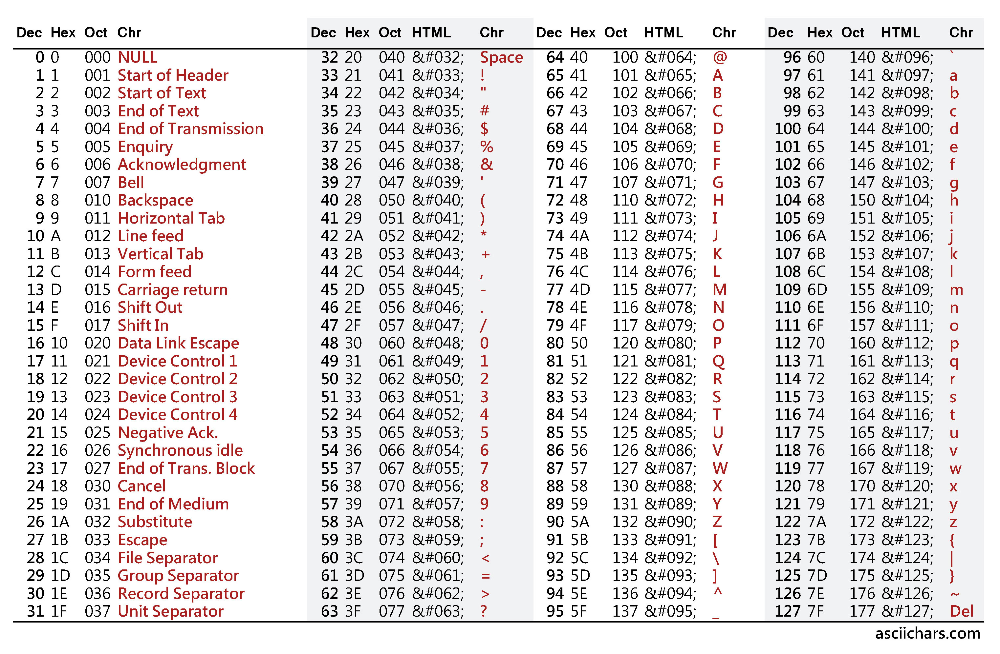

# Sổ tay Pascal

## Chương 2: biến số, hằng và kiểu dữ liệu

### Các kiểu dữ liệu có sẵn

| Kiểu | Định nghĩa | Giới hạn |
| --- | --- | --- |
| `boolean` | Là kiểu dữ liệu chứa hai phần tử `true` và `false` | `true` và `false` |
| `byte` | Số nguyên không âm | `0 .. 255` |
| `char` | Một ký tự | `0 .. 127` |
| `integer` | Một số nguyên | 16-bit: `-32768 .. 32767` |
| `real` | Số thực có dấu chấm thập phân và có thể có ký hiệu E | Phụ thuộc vào nền tảng đang chạy |
| `cardinal` | Số nguyên không âm với giới hạn lớn | 32-bit: `0 .. 4294967295` |
| `set` | Là tập hợp các phần tử liên quan; kích cỡ tùy vào số lượng phần tử | - |
| `pointer` | Là con trỏ trỏ tới một vị trí trong bộ nhớ, thường dùng cho các biến số động (không tĩnh) | - |
| `record` | Là kiểu cho phép kết hợp nhiều kiểu dữ liệu ở trên với nhau | - |
| `array` | Mảng. Là tập hợp các đối tượng cùng kiểu dữ liệu được xếp liên tiếp trên bộ nhớ. | - |
| `string` | Xâu. Là mảng tập hợp các đối tượng là ký tự. | 255 kí tự |

### 2.1 Kiểu dữ liệu

Kiểu dữ liệu là sự phân loại của biến số hoặc hằng. Có một số kiểu dữ liệu được định nghĩa sẵn bởi bất cứ bộ biên dịch Pascal nào (vì bạn cần phải dùng chúng để tạo ra tất cả thứ khác). Các kiểu dữ liệu được nói ở đầu Chương 2.

**Kiểu cơ bản**

### 2.2 biến số

Biến số là một biểu tượng đại diện cho một phân bố bộ nhớ có chứa nội dung (ký tự, số nguyên, ...) mà bạn có thể định nghĩa. Chúng có thể nằm trong phạm vi toàn bộ chương trình (biến số toàn cục) hoặc là chỉ trong thủ tục, hàm hoặc phương thức (biến số địa phương).

Sau đây là chương trình mẫu cho biến số:
```pascal
program VariblesDemo;
uses crt;
var
    a   : integer = 23;
    b   : real = 456.12;
    c   : char = 'h';
    d   : string = 'this is a string';
begin
    writeln('a = ', a); //  23
    writeln('b = ', b); //  456.12
    writeln('c = ', c); //  'h'
    writeln('d = ', d); //  'this is a string'
end.
```

Để gán giá trị cho biến số trong chương trình, ta sử dụng dấu `:=`
```pascal
program Varibles2Demo;
uses crt;
var
    a   : integer;
    s   : string;
begin
    a := 12;
    writeln('a = ', a); //  12
    a := 78;
    writeln('a = ', a); //  78
    s := 'Hello';
    writeln('s = ', s); //  'hello'
    s := ', World';
    writeln('s = ', s); //  ', World'
end.
```

> *Lưu ý*: Kiểu dữ liệu `String` không hỗ trợ gõ tiếng Việt. Nếu bạn cố viết trong chương trình, khi thực hiện, chương trình sẽ in ra ký tự lỗi.

### 2.3 Hằng

Hằng cũng là một biểu tượng như biến số, nhưng khác biến số ở chỗ nó không thể bị sửa đổi giá trị trên cả chương trình.

```pascal
program ConstDemo;
uses crt;
const
    a   = 12;
    b   = 34.43;
    s   = 'abcdef';
begin
    writeln('a = ', a); //  '12'
    writeln('b = ', b); //  '34.43'
    writeln('s = ', s); //  'abcdef'
end.
```

Nếu bạn cố gằng gán giá trị cho hằng, chẳng hạn như câu lệnh sau, sẽ tạo ra lỗi biên dịch:
```pascal
s := 'This is a string';
```

### 2.4 Ép kiểu

Đôi khi, biến số của bạn đang có kiểu dữ liệu nguyên nhưng bạn cần có kiểu dữ liệu thực để chạy được chương trình. Khi đó, chúng ta dùng ép kiểu:
```pascal
program TypeCastDemo;
uses crt; 
var
    c   : char = 'a';
    i   : integer;    
begin
    i := integer (i); //  97
end.
```
Ở ví dụ trên, biến số bị ép `c` có kiểu ký tự. Khi ép, biến số `i` sẽ theo bảng mã [ASCII](http://www.asciitable.com/) để quy đổi (ví dụ, ký tự `a` có mã `97` trong bảng mã ASCII).

