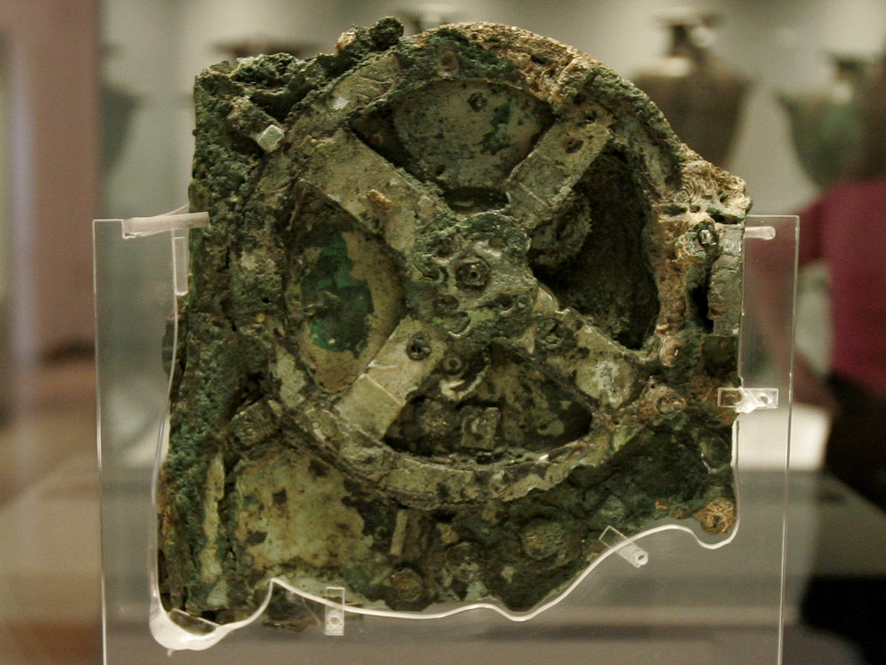
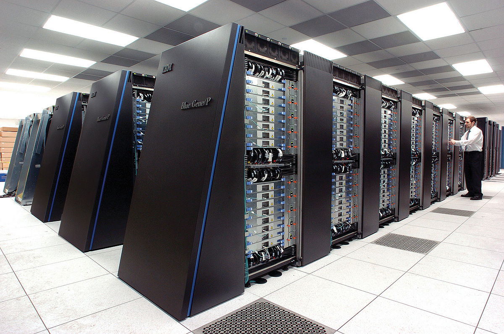
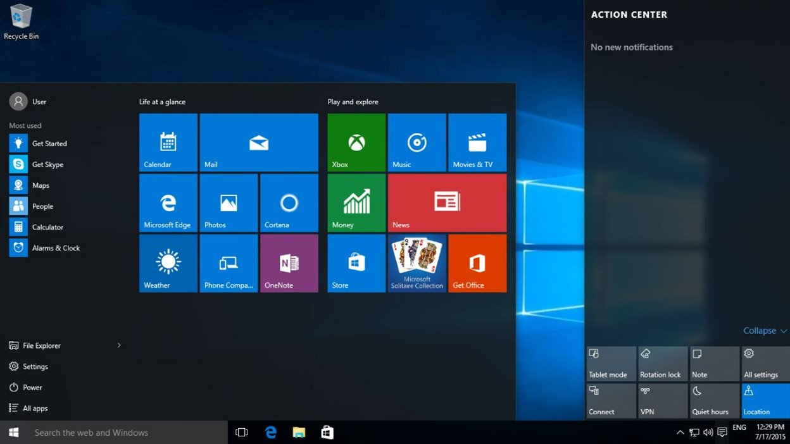
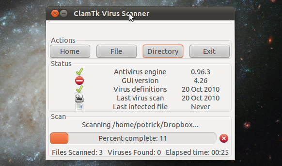
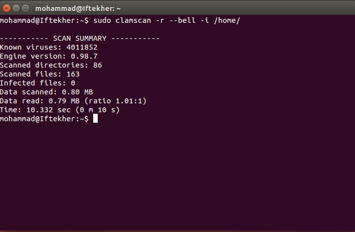
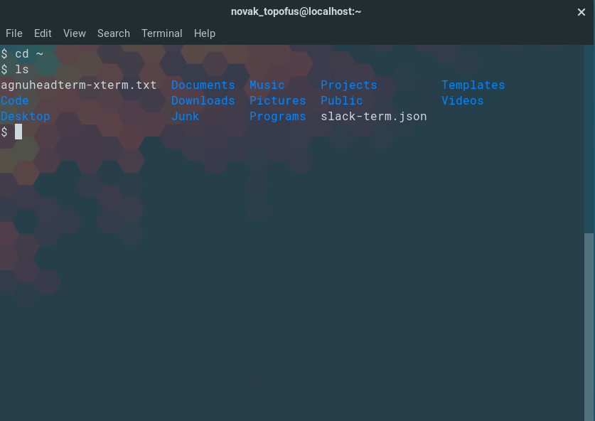

Các câu hỏi thường gặp
======================

Các câu hỏi mà các bạn đọc có thể sẽ thắc mắc sẽ được giải đáp tại đây. Chúng được phân loại theo chương. Chúng tôi không giải đáp ngay trong chương mà giải đáp ở một trang riêng như thế này là vì nếu cho phần giải đáp đi kèm với chương, chương sẽ trở nên dài.

Mục lục
-------
1. [Chương 1](#chương-1)
2. [Chương 2](#chương-2)
3. [Chương 3](#chương-3)
4. [Chương 4](#chương-4)
5. [Chương 5](#chương-5)
6. [Chương 6](#chương-6)

Chương 1
--------

### Từ “máy tính” có thể được hiểu như thế nào?

Trên mạng, nếu tra định nghĩa của máy tính, sẽ gặp hai định nghĩa được sử dụng nhiều nhất như sau:

1. Thiết bị điện tử có khả năng thực thi các lệnh được giao cho nó
2. Thiết bị tính toán

Theo định nghĩa 1, máy tính sẽ bao gồm máy tính cá nhân, máy tính bảng, điện thoại, TV. Theo định nghĩa 2, máy tính sẽ bao gồm tất cả các thiết bị vừa được liệt kê cộng thêm nhiều thiết bị khác, bao gồm các thiết bị không phải là điện tử như bàn tính.

Định nghĩa 2 nghe có vẻ như hợp lý hơn. Trong tiếng Anh, máy tính là “computer”. "compute" là tính toán, vậy “computer” là thiết bị tính toán, nghe có vẻ hợp lý. Tuy nhiên, trong Tin học, người ta liên kết máy tính với định nghĩa 1 nhiều hơn.

Trong giao tiếp ngày thường, khi mọi người nói đến máy tính, họ đang nói đến máy tính cá nhân, tức bao gồm máy tính xách tay và máy tính để bàn. Với điện thoại, họ gọi nó là điện thoại chứ không gọi nó là máy tính. Tương tự như thế với TV. Khi nói đến máy tính, mọi người cũng có thể đang nói đến máy tính cầm tay.

Dùng định nghĩa nào là tùy bạn, đừng để mọi người bị nhầm lẫn là được.

Bảng sau chứa một số ví dụ về máy tính. Nhấp chuột trái lên ảnh để có ảnh to hơn.

<table>
    <thead>
    </thead>
    <tbody>
        <tr>
            <td>
                
            </td>
            <td>
                
            </td>
            <td>
                
            </td>
            <td>
                
            </td>
        </tr>
        <tr>
            <td align="center">Máy tính thiên văn cổ</td>
            <td align="center">Bàn tính</td>
            <td align="center">Máy tính xách tay</td>
            <td align="center">Máy tính để bàn</td>
        </tr>
        <tr>
            <td>
                
            </td>
            <td>
                
            </td>
            <td>
                
            </td>
            <td>
                
            </td>
        </tr>
        <tr>
            <td align="center">Siêu máy tính</td>
            <td align="center">TV</td>
            <td align="center">Điện thoại di động</td>
            <td align="center">Đồng hồ điện tử</td>
        </tr>
    </tbody>
</table>

### Free Pascal, Turbo Pascal và GNU Pascal khác nhau ở chỗ nào?

Free Pascal, Turbo Pascal và GNU Pascal đều là những biến thể của ngôn ngữ Pascal. Điều này nghĩa là sao vậy?

Chẳng hạn như tiếng Việt, tùy vào địa phương mà người ta nói một thứ gì đó theo cách khác nhau. Ví dụ như người miền Bắc nói là "quả táo", người miền Nam nói là "trái táo". Vậy tiếng Việt thì có nhiều tiếng địa phương. Biến thể của một ngôn ngữ lập trình cũng có thể được hiểu như là một tiếng địa phương của một ngôn ngữ giao tiếp vậy. Free Pascal, Turbo Pascal, và GNU Pascal, mỗi biến thể đều theo những quy định chung của ngôn ngữ Pascal, nhưng chúng cũng có những quy định riêng.

Vì chúng có những quy định riêng nên chúng cũng có các trình biên dịch riêng. Free Pascal có trình biên dịch riêng cùng tên, và Turbo Pascal và GNU Pascal cũng vậy.

### Ta có thể gỡ lỗi với một trình biên tập mã không? Một trình biên tập mã và một môi trường phát triển tích hợp khác nhau ở chỗ nào?

Các trình biên tập mã ngày nay cũng có thể tích hợp chức năng của trình gỡ lỗi và trình biên dịch/thông dịch như môi trường phát triển tích hợp, cho dù là có sẵn hay phải cài như một phần tử mở rộng (extension). Sự khác nhau cơ bản nhất của một trình biên tập mã và một môi trường phát triển tích hợp là:

Môi trường phát triển tích hợp tập trung vào sự phát triển của một chương trình dưới một ngôn ngữ nào đó, và tích hợp sẵn trình biên dịch/thông dịch và trình gỡ lỗi dành riêng cho ngôn ngữ nào đó. Còn trình biên tập mã sẽ đi hướng rộng hơn và hỗ trợ nhiều ngôn ngữ khác nhau, nhưng thường lại không tích hợp sẵn trình gỡ lỗi hay trình biên dịch/thông dịch nào cả.

Lấy ví dụ, [Lazarus](http://www.lazarus-ide.org/) là môi trường phát triển tích hợp dành cho Free Pascal. Nó có phần để người lập trình viên chỉnh sửa mã Pascal, nó có tính năng tô màu cú pháp cho Pascal, và nó có tích hợp cả trình biên dịch Free Pascal và trình gỡ lỗi dành cho Free Pascal. Tuy nhiên, nếu bạn dùng một trình biên tập mã như Atom hay Visual Studio Code để viết mã Pascal, thì không những bạn phải tải một phần mở rộng để hỗ trợ việc tô màu cú pháp Pascal, mà lại còn phải tự mình tích hợp lấy trình biên dịch và trình gỡ lỗi, cũng như một số công cụ khác để giúp bạn viết chương trình Pascal. Đương nhiên, bạn cũng có thể viết chương trình Pascal trong một trình biên tập mã mà không cần những thứ như trình biên dịch và các công cụ khác. Tuy nhiên, lúc đó việc phát triển một phần mềm Pascal, đặc biệt là phần mềm lớn, sẽ trở nên khó khăn.

### Nếu bản thân trình biên dịch là một chương trình máy tính, thì người ta làm thế nào để tạo ra trình biên dịch?

Một trình biên dịch cho ngôn ngữ A có thể được viết bằng ngôn ngữ B. Chẳng hạn như, trình biên dịch GNU Pascal - dành cho biến thể GNU Pascal - được viết bằng ngôn ngữ lập trình C. Vì vậy, ta có thể viết một trình biên dịch cho ngôn ngữ A bằng ngôn ngữ B, và dùng trình biên dịch cho ngôn ngữ B để tạo ra trình biên dịch cho ngôn ngữ A. Ta có thể biểu diễn các bước đó như sau:

1. Viết mã nguồn cho trình biên dịch của ngôn ngữ A bằng ngôn ngữ B
2. Dùng trình biên dịch của ngôn ngữ B để biên dịch ra trình biên dịch cho ngôn ngữ A
3. Giờ ta đã có trình biên dịch cho ngôn ngữ A, ta có thể viết một trình biên dịch cho ngôn ngữ A bằng ngôn ngữ A, hoặc tiếp tục phát triển trình biên dịch cho ngôn ngữ A được viết bằng ngôn ngữ B như ta đã có ban đầu

Từ đó, ta lại có thêm một câu hỏi: Vậy trình biên dịch đầu tiên được viết bằng ngôn ngữ gì?
Trình biên dịch đầu tiên được tạo bằng ngôn ngữ máy. Nghe có vẻ khó tin vì lập trình bằng ngôn ngữ máy là rất khó, nhưng ta có thể viết một trình biên dịch rất đơn giản bằng ngôn ngữ máy, sau đó dùng trình biên dịch rất đơn giản này để tạo ra những trình biên dịch phức tạp hơn, cứ như vậy cho đến khi ta có một trình biên dịch đủ tốt.

### Với các tệp tin chứa mã nguồn của một chương trình Pascal, thì phần mở rộng có nhất thiết phải là "pas" không?

Như ta đã biết, với các tệp tin chứa mã nguồn Pascal, thì phải có phần mở rộng là "pas". Một số ví dụ về tên tệp tin chứa mã nguồn Pascal có thể là "_program.pas_" hay "_script.pas_".

Thực ra, tệp tin mã nguồn Pascal không nhất thiết phải có phần mở rộng là "pas". Bạn có thể đặt phần mở rộng là "fls", hay "mlc", và khi đem tệp tin đi để biên dịch, thì trình biên dịch vẫn chấp nhận tệp tin đó (ít nhất là với trình biên dịch Free Pascal thì điều đó hoàn toàn đúng). Tuy nhiên, bạn vẫn nên (và cần luôn luôn) đặt phần mở rộng của một tệp tin mã nguồn Pascal là "pas". Tại sao vậy?

Đó là vì, có những hệ điều hành, hệ thống cũng như các phần mềm sẽ nhận dạng phần mở rộng của các tệp tin được đem vào xử lý, và có thể thực hiện các thao tác khác nhau tùy vào phần mở rộng đó. Như hệ điều hành Windows, chẳng hạn, nó sẽ nhận dạng phần mở rộng của các tệp tin trên máy tính và, khi bạn bấm chuột lên tệp tin để mở tệp tin đó, thì tùy vào phần mở rộng của tệp tin mà Windows sẽ bắt đầu chương trình thích hợp để xử lý tệp tin đó. Chẳng hạn, nếu bạn mở tệp tin có phần mở rộng là "pdf", thì có thể một phần mềm xem tài liệu PDF sẽ được mở lên. Hay nếu tệp tin có phần mở rộng là "mp4", thì một phần mềm xem video sẽ được mở lên. Tuy nhiên, những phần mềm như phần mềm xem tài liệu PDF hay xem ảnh, xem video thì sẽ không nhận mã nguồn Pascal, và nếu "đưa" chúng mã nguồn Pascal thì chúng sẽ không biết cách xử lý như thế nào. Nếu bạn viết mã nguồn Pascal và lưu thành tệp tin có tên như "_something.mp4_", "_myfile.jpg_", thì khi mở những tệp tin đó, phần mềm chuyên xử lý các tệp tin có định dạng đó sẽ xuất hiện lên và có thể báo lỗi hoặc ngưng hoạt động. Vì vậy, phải luôn luôn để phần mở rộng của tệp tin chứa mã nguồn Pascal là "pas".

### Nếu biên dịch một mã nguồn Pascal trên một hệ điều hành nào đó, thì ta có thể đem chương trình đã được biên dịch sang một hệ điều hành khác để chạy chương trình đó không?

Không. Ở mỗi hệ điều hành, định dạng tệp thực thi của chúng khác hẳn nhau. Chẳng hạn, GNU/Linux hầu như sử dụng định dạng ELF trong khi Windows sử dụng định dạng PE. Mỗi định dạng được tối ưu cho việc gọi thư viện, API cho hệ điều hành của nó. Mà mỗi hệ điều hành có nhân và thư viện khác nhau nên việc đem thẳng chương trình biên dịch sang hệ điều hành khác trên lý thuyết là không thể. Nên nếu bạn muốn đem chương trình được biên dịch cho hệ điều hành này đem chạy trên hệ điều hành khác, bạn phải giả lập hoặc dịch tất cả các lệnh gọi API của chương trình. Nó giống như việc ngôn ngữ mẹ đẻ của bạn là Tiếng Việt, và bạn đang học Tiếng Anh, bảng chữ cái là định dạng tệp thực thi, và API là vốn từ vựng của bạn.

### Command Prompt và Terminal chính xác là những cái gì? `C:` là gì? `cd` là gì? `ls` là gì? `fpc` là gì?

Command Prompt là một phần mềm cung cấp giao diện dòng lệnh, dành cho hệ điều hành Windows. Terminal cũng giống như Command Prompt, nhưng là dành cho các hệ điều hành tựa Unix như GNU và macOS.

Giao diện dòng lệnh là gì?

Với các máy tính hiện đại đi kèm với một hệ điều hành hiện đại ngày nay, rất có thể bạn đang sử dụng giao diện đồ họa để điều khiển máy tính. Bạn có thể thấy các hình biểu tượng. Bạn thấy hình biểu tượng của Google Chrome, bạn nháy chuột lên đó, và bạn đã mở được Google Chrome. Hay bạn có thể điều chỉnh cấu hình bằng cách bấm các nút, hay lăn những con lăn (slider), xem hình ảnh, vân vân. Bạn mở phần mềm quản lý tệp tin, bạn có thể bấm lên hình biểu tượng của các thư mục để tìm cái tệp tin bạn cần mở, rồi mở tệp tin đó cũng bằng cách bấm lên hình biểu tượng của nó luôn. Đó là giao diện đồ họa, nơi mà bạn có thể tương tác với máy tính qua các hình biểu tượng và qua cách bấm nút.

Vậy giao diện dòng lệnh là gì? Giao diện dòng lệnh là giao diện người dùng mà, người dùng phải gõ các câu lệnh để sử dụng và tương tác với máy tính. Bạn muốn tìm tệp tin và mở tệp tin trong giao diện dòng lệnh ư? Bạn sẽ cần phải gõ các câu lệnh để di chuyển giữa các thư mục trong máy tính của bạn, và khi đã tìm thấy tệp tin rồi thì bạn phải triển khai một phần mềm bạn dùng để xử lý tệp tin đó, cũng bằng cách gõ các câu lệnh.

<table>
    <thead></thead>
    <tbody>
        <tr>
            <td>
                
            </td>
            <td>
                
            </td>
        </tr>
        <tr>
            <td align="center">Giao diện đồ họa</td>
            <td align="center">Giao diện dòng lệnh</td>
        </tr>
    </tbody>
</table>

Khi ở trong giao diện dòng lệnh, thông thường thì bạn sẽ được đặt tại một địa chỉ thư mục nào đó. Từ đó, bạn sẽ gõ lệnh để di chuyển sang các thư mục khác. Thông thường, các lệnh thực ra là các chương trình máy tính. Một chương trình máy tính có thể được sử dụng trong giao diện dòng lệnh, nhưng cũng có thể được sử dụng trong giao diện đồ họa, như phần mềm diệt vi-rút ClamAV.

<table>
    <thead></thead>
    <tbody>
        <tr>
            <td>
                
            </td>
            <td>
                
            </td>
        </tr>
        <tr>
            <td align="center">Giao diện đồ họa của phần mềm ClamAV</td>
            <td align="center">Phần mềm ClamAV được sử dụng trong giao diện dòng lệnh</td>
        </tr>
    </tbody>
</table>

Khi sử dụng các chương trình qua giao diện dòng lệnh, ta cũng có thể thêm vào các tùy chọn, như là sử dụng giao diện đồ họa của chương trình đó vậy. Ví dụ như trong ví dụ trên, ở cột thứ hai, bạn sẽ thấy trong ảnh là phần mềm ClamAV được sử dụng qua dòng lệnh `clamscan -r --bell -i /home/`. `clamscan` là lệnh được dùng để bắt đầu phần mềm ClamAV trong giao diện dòng lệnh, và `-r`, `--bell`, `-i`, `/home/` là các tùy chọn. `-r` là tùy chọn để phần mềm quét cả những tệp tin trong thư mục con, `--bell` là tùy chọn để máy tính phát ra tiếng chuông báo khi phần mềm đã phát hiện được tệp tin bị nhiễm vi-rút hoặc chương trình độc hại, và tùy chọn `-i` là tùy chọn được dùng để phần mềm chỉ in ra màn hình những tệp tin bị nhiễm chương trình độc hại (bởi theo mặc định, phần mềm ClanAV khi quét sẽ in ra cả tệp tin an toàn và cả tệp tin bị nhiễm).

`cd`, `ls`, và `fpc` là các lệnh để gọi phần mềm cd, ls, và trình biên dịch Free Pascal qua giao diện dòng lệnh.

`cd` là phần mềm dùng để di chuyển từ thư mục này sang thư mục khác. Thông thường, khi dùng `cd`, người ta chỉ thêm vào 1 tùy chọn, đó là tên thư mục cần di chuyển đến. Chẳng hạn, khi ta gõ lệnh `cd C:\User\`, thì ta đang chỉ định thư mục ta muốn đến - thư mục _C:\\User\\_ - cho phần mềm cd. Lúc đó, phần mềm sẽ đưa ta đến thư mục _C:\\User\\_ trong giao diện dòng lệnh để ta có thể thao tác với các thư mục hay tệp tin ở trong thư mục đó. Lúc này, ta gọi _C:\\User\\_ là thư mục hiện hành.

`ls` là phần mềm dùng để liệt kê tất cả các tệp tin và thư mục trong thư mục hiện hành. Ta có thể dùng nó mà không cần thêm tùy chọn.
Ảnh dưới đây chụp một cửa sổ Terminal chạy lệnh `cd ~` và `ls`.

Với các máy tính chạy hệ điều hành tựa Unix, `~` là kí hiệu cho thư mục Home. Thư mục Home là thư mục để người dùng máy tính lưu trữ các tài liệu, tệp tin và thông tin của mình ở trong đó. Vì vậy, gõ `cd ~` tức là di chuyển đến thư viện Home.

`fpc` là trình biên dịch Free Pascal. Để biên dịch một chương trình Pascal trong giao diện dòng lệnh, bạn cần thêm tùy chọn về tên tệp tin (hoặc đường dẫn tệp tin) chứa mã nguồn Pascal. Ví dụ, nếu tệp tin chứa mã nguồn Pascal của bạn có tên là "_script.pas_" và nó đang ở trong thư mục có địa chỉ là _/home/user/code/pascal_, bạn có thể gõ "`cd /home/user/code/pascal`", nhấn Enter để chạy lệnh, rồi gõ "`fpc script.pas`", rồi nhấn Enter để chạy lệnh. Hoặc bạn cũng có thể gõ "`fpc /home/user/code/pascal/script.pas`", trong trường hợp này, "/home/user/code/pascal/script.pas" là đường dẫn của tệp tin trên máy tính của bạn.

`C:` là lệnh trong Command Prompt, dùng để chuyển ổ hiện hành sang ổ C. Từ đó ta có thể thao tác với các tệp tin và các thư mục trong ổ C. Ta cũng có thể gõ "`Z:`" để chuyển sang ổ Z, "`D:`" để chuyển sang ổ D.
