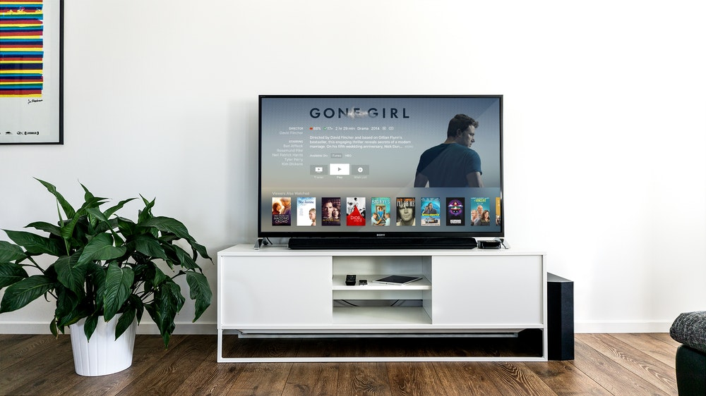

Các câu hỏi thường gặp
======================

Các câu hỏi mà các bạn đọc có thể sẽ thắc mắc sẽ được giải đáp tại đây. Chúng được phân loại theo chương. Chúng tôi không giải đáp ngay trong chương mà giải đáp ở một trang riêng như thế này là vì nếu cho phần giải đáp đi kèm với chương, chương sẽ trở nên dài.

Mục lục
-------
1. [Chương 1](#chương-1)
2. [Chương 2](#chương-2)
3. [Chương 3](#chương-3)
4. [Chương 4](#chương-4)
5. [Chương 5](#chương-5)
6. [Chương 6](#chương-6)

Chương 1
--------

### Từ “máy tính” có thể được hiểu như thế nào?

Trên mạng, nếu tra định nghĩa của máy tính, sẽ gặp hai định nghĩa được sử dụng nhiều nhất như sau:

1. Thiết bị điện tử có khả năng thực thi các lệnh được giao cho nó
2. Thiết bị tính toán

Theo định nghĩa 1, máy tính sẽ bao gồm máy tính cá nhân, máy tính bảng, điện thoại, TV. Theo định nghĩa 2, máy tính sẽ bao gồm tất cả các thiết bị vừa được liệt kê cộng thêm nhiều thiết bị khác, bao gồm các thiết bị không phải là điện tử như bàn tính.

Định nghĩa 2 nghe có vẻ như hợp lý hơn. Trong tiếng Anh, máy tính là “computer”. "compute" là tính toán, vậy “computer” là thiết bị tính toán, nghe có vẻ hợp lý. Tuy nhiên, trong Tin học, người ta liên kết máy tính với định nghĩa 1 nhiều hơn.

Trong giao tiếp ngày thường, khi mọi người nói đến máy tính, họ đang nói đến máy tính cá nhân, tức bao gồm máy tính xách tay và máy tính để bàn. Với điện thoại, họ gọi nó là điện thoại chứ không gọi nó là máy tính. Tương tự như thế với TV. Khi nói đến máy tính, mọi người cũng có thể đang nói đến máy tính cầm tay.

Dùng định nghĩa nào là tùy bạn, đừng để mọi người bị nhầm lẫn là được.

Bảng sau chứa một số ví dụ của một "máy tính". Nhấp chuột trái lên ảnh để có ảnh to hơn.

<table>
    <thead>
    </thead>
    <tbody>
        <tr>
            <td>
                
            </td>
            <td>
                
            </td>
            <td>
                
            </td>
            <td>
                
            </td>
        </tr>
        <tr>
            <td align="center">Máy tính thiên văn cổ</td>
            <td align="center">Bàn tính</td>
            <td align="center">Máy tính xách tay</td>
            <td align="center">Máy tính để bàn</td>
        </tr>
        <tr>
            <td>
                
            </td>
            <td>
                
            </td>
            <td>
                
            </td>
            <td>
                
            </td>
        </tr>
        <tr>
            <td align="center">Siêu máy tính</td>
            <td align="center">TV</td>
            <td align="center">Điện thoại di động</td>
            <td align="center">Đồng hồ điện tử</td>
        </tr>
    </tbody>
</table>

### Free Pascal, Turbo Pascal và GNU Pascal khác nhau ở chỗ nào?

Free Pascal, Turbo Pascal và GNU Pascal đều là những biến thể của ngôn ngữ Pascal. Điều này nghĩa là sao vậy?

Chẳng hạn như tiếng Việt, tùy vào địa phương mà người ta nói một thứ gì đó theo cách khác nhau. Ví dụ như người miền Bắc nói là "quả táo", người miền Nam nói là "trái táo". Vậy tiếng Việt thì có nhiều tiếng địa phương. Biến thể của một ngôn ngữ lập trình cũng có thể được hiểu như là một tiếng địa phương của một ngôn ngữ giao tiếp vậy. Free Pascal, Turbo Pascal, và GNU Pascal, mỗi biến thể đều theo những quy định chung của ngôn ngữ Pascal, nhưng chúng cũng có những quy định riêng.

Vì chúng có những quy định riêng nên chúng cũng có các trình biên dịch riêng. Free Pascal có trình biên dịch riêng cùng tên, và Turbo Pascal và GNU Pascal cũng vậy.

### Ta có thể gỡ lỗi với một trình biên tập mã không? Một trình biên tập mã và một môi trường phát triển tích hợp khác nhau ở chỗ nào?

Các trình biên tập mã ngày nay cũng có thể tích hợp chức năng của trình gỡ lỗi và trình biên dịch/thông dịch như môi trường phát triển tích hợp, cho dù là có sẵn hay phải cài như một phần tử mở rộng (extension). Sự khác nhau cơ bản nhất của một trình biên tập mã và một môi trường phát triển tích hợp là:

Môi trường phát triển tích hợp tập trung vào sự phát triển của một chương trình dưới một ngôn ngữ nào đó, và tích hợp sẵn trình biên dịch/thông dịch và trình gỡ lỗi dành riêng cho ngôn ngữ nào đó. Còn trình biên tập mã sẽ đi hướng rộng hơn và hỗ trợ nhiều ngôn ngữ khác nhau, nhưng thường lại không tích hợp sẵn trình gỡ lỗi hay trình biên dịch/thông dịch nào cả.

Lấy ví dụ, [Lazarus](http://www.lazarus-ide.org/) là môi trường phát triển tích hợp dành cho Free Pascal. Nó có phần để người lập trình viên chỉnh sửa mã Pascal, nó có tính năng tô màu cú pháp cho Pascal, và nó có tích hợp cả trình biên dịch Free Pascal và trình gỡ lỗi dành cho Free Pascal. Tuy nhiên, nếu bạn dùng một trình biên tập mã như Atom hay Visual Studio Code để viết mã Pascal, thì không những bạn phải tải một phần mở rộng để hỗ trợ việc tô màu cú pháp Pascal, mà lại còn phải tự mình tích hợp lấy trình biên dịch và trình gỡ lỗi, cũng như một số công cụ khác để giúp bạn viết chương trình Pascal. Đương nhiên, bạn cũng có thể viết chương trình Pascal trong một trình biên tập mã mà không cần những thứ như trình biên dịch và các công cụ khác. Tuy nhiên, lúc đó việc phát triển một phần mềm Pascal, đặc biệt là phần mềm lớn, sẽ trở nên khó khăn.
